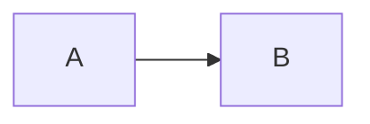

# Code blocks and frontmatter

YAML frontmatter above should show faint `---` delimiters (opacity setting).

## Fenced with language

```typescript
function greet(name: string): string {
  return `Hello, ${name}`;
}
```

## No language

```
plain text block
no highlighting expected
```

## Mermaid in code fence (see also 09-mermaid.md)



## Inline vs fence

Use `const x = 1` inline and a fence below.

```json
{ "ok": true }
```

---

**Checks**

- Frontmatter delimiters faint, body not decorated as markdown.
- Language tag on fence: faint opacity on lang identifier.
- Cursor inside fence: raw syntax for that block.
