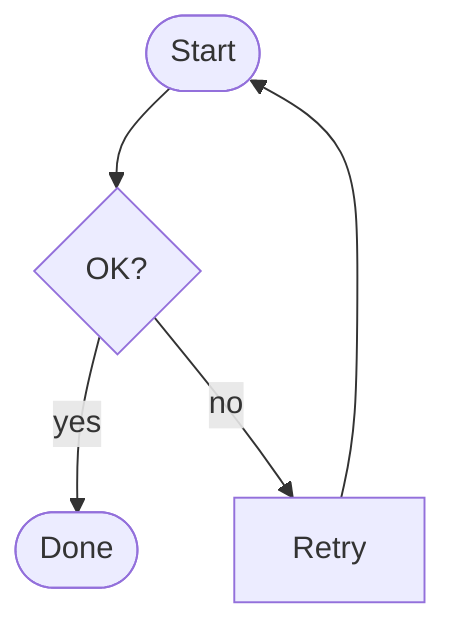
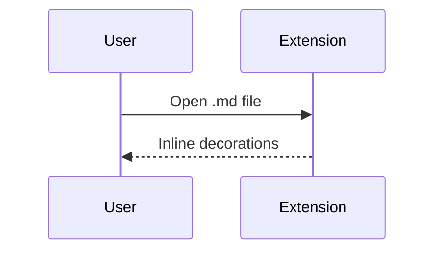
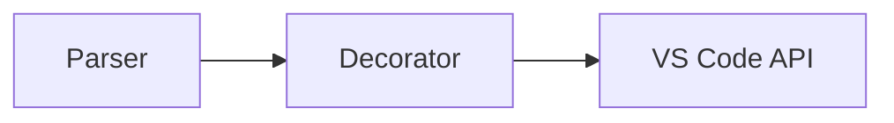

# Mermaid diagrams

Diagrams render inline in the editor (may take a moment on first paint).

## Flowchart

## Sequence

## Simple graph

---

**Checks**

- Diagram visible without opening preview.
- Cursor in mermaid block: raw fence + source visible.
- Activity bar **Markdown Inline** entry is the hidden Mermaid host (can ignore).
