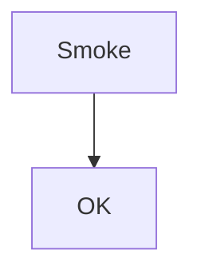

# Smoke test (one page)

Quick visual pass. For depth, open numbered fixtures in this folder.

## Text

**bold** *italic* ***both*** ~~strike~~ `code` :smile:

## Structure

### Heading 3

> blockquote

---

[link](https://example.com) <https://auto.example>


## Lists

- [ ] task open
- [x] task done

1. one
1. two

## Table

| A | B |
|---|---|
| 1 | 2 |

## Code / math / mermaid

```js
console.log("hi");
```

Inline $x^2$ and block:

$$
y = mx + b
```



## Mentions

@dev-user fix #7 in @org/team

---

**Done?** Toggle decorations off/on. Compare file in diff view (raw expected by default).
